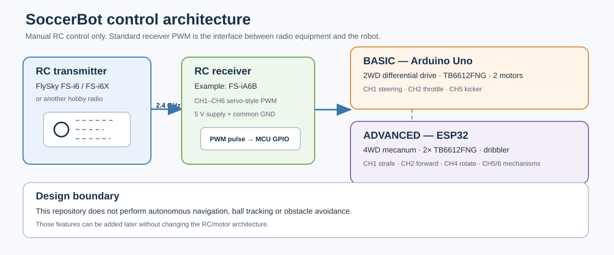
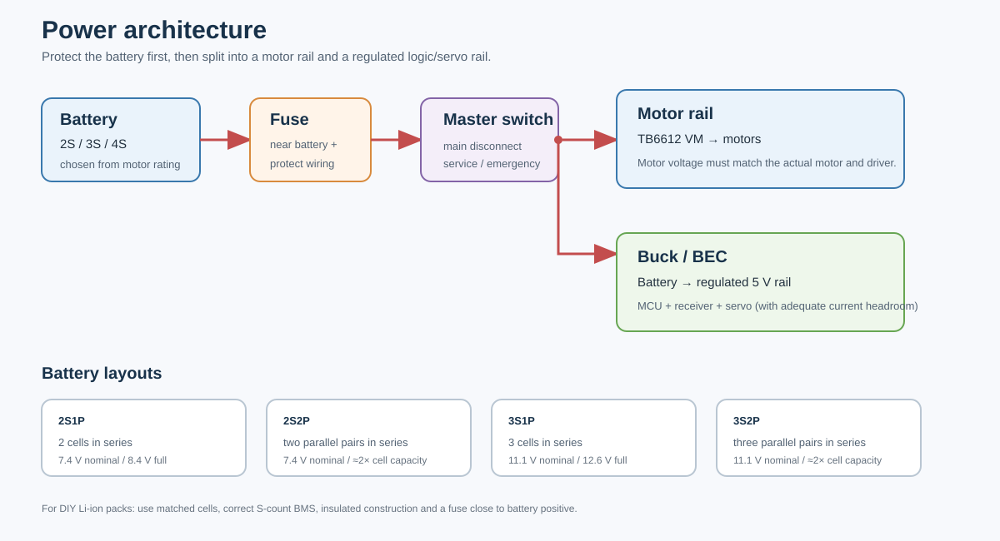
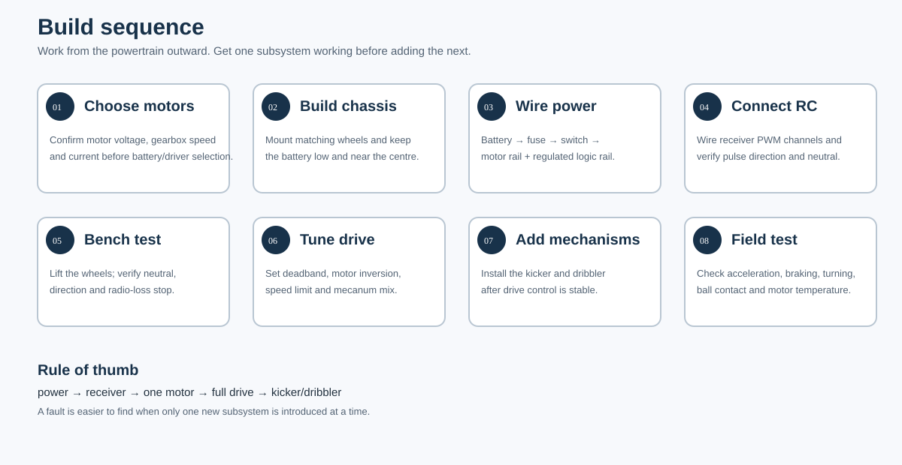
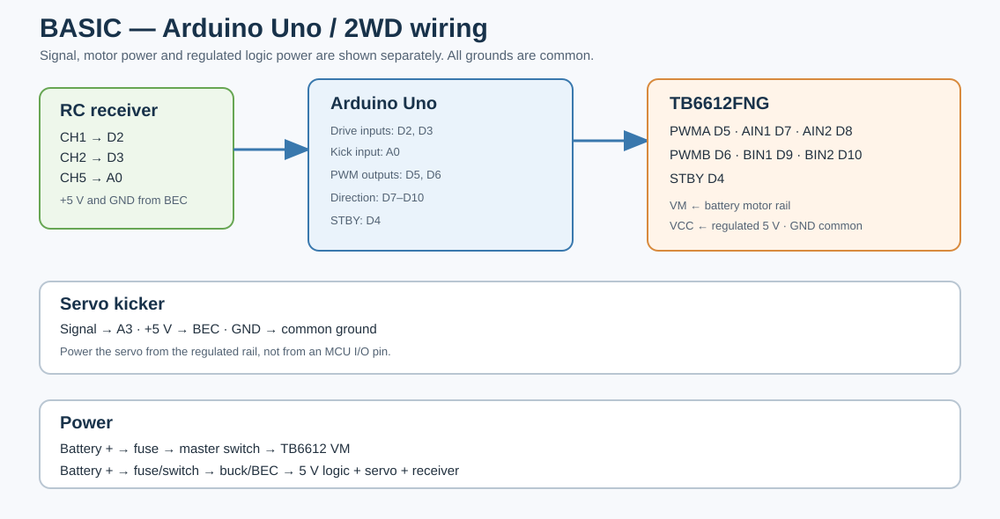
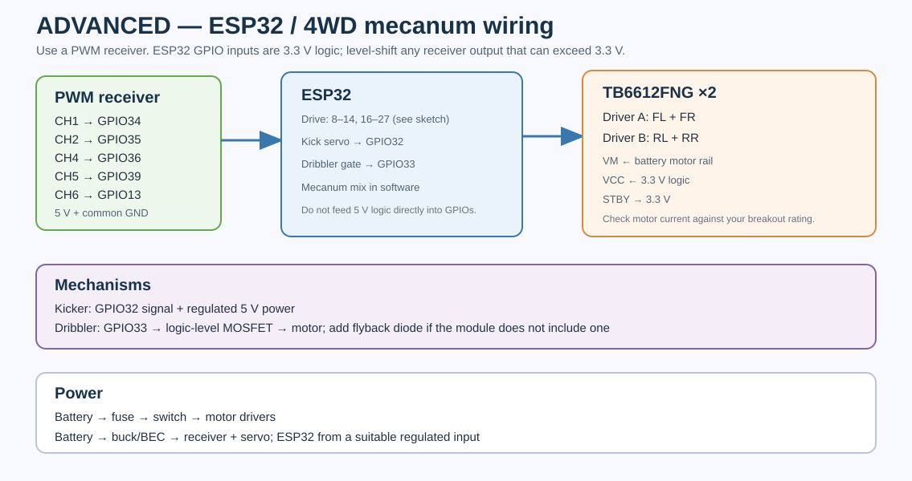
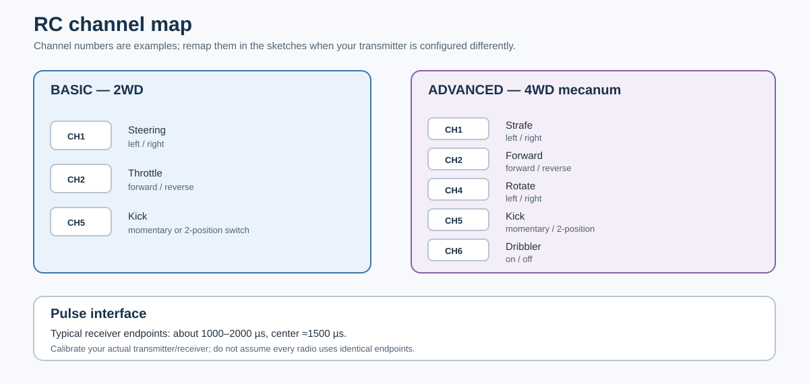

# OpenSoccerBot

A practical, manual RC soccer robot platform with two hardware paths:

- **BASIC:** Arduino Uno + 2WD differential drive
- **ADVANCED:** ESP32 + 4WD mecanum drive + kicker + dribbler

The two versions use the same control concept: a conventional hobby RC transmitter and receiver. The receiver provides servo-style PWM pulses to the robot controller; the controller converts those commands into motor and mechanism outputs.

**Scope:** this repository is manual-control only. There is no autonomous navigation, ball tracking or obstacle avoidance firmware here.

## 1. System architecture



The signal chain is deliberately simple:

```text
RC transmitter
      │
      │ 2.4 GHz radio link
      ▼
RC receiver
      │
      │ PWM channel pulses
      ▼
Arduino Uno / ESP32
      │
      ├── motor-control outputs
      ├── kicker servo
      └── dribbler output (ADVANCED)
```

That separation is useful in practice. The radio system can be replaced without redesigning the motor-control layer as long as the replacement receiver provides compatible PWM outputs.

---

## 2. Which build should you make?

| | BASIC | ADVANCED |
|---|---|---|
| Controller | Arduino Uno | ESP32 DevKit |
| Drive | 2WD differential | 4WD mecanum |
| Motors | 2 | 4 |
| Motor drivers | 1 × TB6612FNG | 2 × TB6612FNG |
| Kicker | Servo | Servo |
| Dribbler | — | Brushed DC motor + MOSFET |
| RC interface | PWM receiver | PWM receiver |
| Software | Arduino sketch | Arduino/ESP32 sketch + ESP32Servo |
| Main trade-off | simpler mechanics and wiring | more mobility and more hardware |

### BASIC

Use this when the priority is getting a reliable two-wheel robot running with the fewest moving parts. It is also the better platform for learning the complete control chain before moving to mecanum drive.

### ADVANCED

Use this when you want lateral movement, independent four-wheel drive and a dribbler. Mecanum wheels require more mechanical care and tuning; wheel orientation and chassis geometry matter as much as the code.

---

## 3. RC controller compatibility

The project is **not locked to FlySky**. FlySky is simply a convenient, common example.

A useful reference setup is:

- **FlySky FS-i6 / FS-i6X transmitter**
- **FlySky FS-iA6B receiver**

FlySky lists the FS-iA6B as a six-channel 2.4 GHz receiver with PWM, PPM, i.BUS and S.BUS interfaces and a 4.0–8.4 V supply range. This project uses the individual PWM outputs because they are simple to wire and debug. citeturn998736search0

### BASIC channel assignment

| Receiver channel | Function |
|---|---|
| CH1 | steering |
| CH2 | throttle |
| CH5 | kicker |

### ADVANCED channel assignment

| Receiver channel | Function |
|---|---|
| CH1 | strafe |
| CH2 | forward / reverse |
| CH4 | rotation |
| CH5 | kicker |
| CH6 | dribbler |

Channel numbers are configuration choices. Change the pin constants in the sketches when your receiver or transmitter is mapped differently.

### Receiver interface requirements

For another radio system, check these points before wiring it to the robot:

1. The receiver has individual PWM outputs, or you provide a separate protocol adapter.
2. The PWM pulse range is compatible with the firmware's calibration values.
3. Receiver power is within the receiver manufacturer's specified range.
4. Receiver ground and robot-controller ground are common.
5. **For ESP32:** verify the receiver signal voltage. ESP32 GPIOs are not 5 V tolerant; use a level shifter or divider when the receiver output can exceed 3.3 V.

The digital protocols supported by some receivers, such as i.BUS or S.BUS, are not decoded by the base sketches.

More detail is in [`docs/controller_compatibility.md`](docs/controller_compatibility.md).

---

## 4. Hardware — BASIC

### Electrical

| Part | Qty | Notes |
|---|---:|---|
| Arduino Uno R3 / compatible | 1 | 5 V ATmega328P board |
| PWM-output RC receiver | 1 | FS-iA6B is one example |
| RC transmitter | 1 | Match the receiver |
| TB6612FNG dual motor driver | 1 | Verify motor current before purchase |
| DC geared motor | 2 | Match motor voltage and current |
| Servo | 1 | Kicker |
| Battery | 1 | Commonly 2S for small motors, but select from motor rating |
| 5 V buck/BEC | 1 | Receiver + servo + logic rail |
| Fuse | 1 | Near battery positive |
| Master switch | 1 | DC-rated for the system current |
| 2WD chassis + wheels | 1 set | Rigid enough to keep both drive wheels aligned |
| Caster/skid | 1 | Opposite the drive axle |
| Wire/connectors/heat-shrink | 1 set | Sized for measured current |

### Control pins

| Function | Uno pin |
|---|---:|
| CH1 steering | D2 |
| CH2 throttle | D3 |
| CH5 kicker | A0 |
| Motor A PWM | D5 |
| Motor A IN1 / IN2 | D7 / D8 |
| Motor B PWM | D6 |
| Motor B IN1 / IN2 | D9 / D10 |
| TB6612 STBY | D4 |
| Kicker signal | A3 |

Full wiring: [`assets/basic_wiring.svg`](assets/basic_wiring.svg) and [`docs/wiring_basic.md`](docs/wiring_basic.md).

---

## 5. Hardware — ADVANCED

| Part | Qty | Notes |
|---|---:|---|
| ESP32 DevKit | 1 | Common ESP32-WROOM style board |
| PWM-output RC receiver | 1 | Six channels are convenient |
| RC transmitter | 1 | Match the receiver |
| TB6612FNG dual motor driver | 2 | One board for front pair, one for rear pair |
| DC geared motor | 4 | Match motor voltage/current to driver |
| Mecanum wheel | 4 | Correct mirrored roller arrangement required |
| Servo | 1 | Kicker |
| Small brushed DC motor | 1 | Dribbler |
| Logic-level MOSFET stage | 1 | Dribbler switching |
| Battery | 1 | Choose from actual motor rating |
| 5 V buck/BEC | 1 | Receiver + servo rail; size with current margin |
| Fuse + master switch | 1 each | Protect and isolate the pack |
| Chassis/frame | 1 | Rigid enough to keep the four wheel contact points aligned |

### Control and motor pins

| Function | ESP32 GPIO |
|---|---:|
| CH1 strafe | 34 |
| CH2 forward/reverse | 35 |
| CH4 rotate | 36 |
| CH5 kicker | 39 |
| CH6 dribbler | 13 |
| Front-left PWM / IN1 / IN2 | 25 / 4 / 16 |
| Front-right PWM / IN1 / IN2 | 26 / 17 / 18 |
| Rear-left PWM / IN1 / IN2 | 27 / 19 / 21 |
| Rear-right PWM / IN1 / IN2 | 14 / 22 / 23 |
| Kicker signal | 32 |
| Dribbler control | 33 |

Full wiring: [`assets/advanced_wiring.svg`](assets/advanced_wiring.svg) and [`docs/wiring_advanced.md`](docs/wiring_advanced.md).

---

## 6. Motor-driver limits matter

The TB6612FNG is a **small brushed-motor driver**, not a general-purpose high-current controller. Toshiba specifies up to 1.2 A average output current per channel and 3.2 A peak for short pulses under the device's conditions; the operating range includes VCC 2.7–5.5 V and VM 2.5–13.5 V. citeturn303507search24turn303507search26

Your motor choice still determines whether this driver is appropriate. Check the motor's **stall current**, because stall current can be much higher than the no-load or normal running current.

If your motor exceeds the driver's practical current range, change the motor driver instead of trying to force the TB6612FNG to do the job.

---

## 7. Power architecture



Use a protected battery supply with two logical branches:

```text
Battery +
   │
  Fuse
   │
Master switch
   ├──────────────→ motor-driver VM → motors
   │
   └──────────────→ buck / BEC → regulated logic + receiver + servo

Battery − ─────────→ common ground for all electronics
```

The motor rail carries the high-current loads. The regulated rail supplies the controller, receiver and servo. Do not try to run motors from an Arduino/ESP32 5 V rail.

### BASIC power notes

- TB6612 VCC: regulated logic supply
- TB6612 VM: battery motor rail
- Servo: regulated 5 V/BEC
- Receiver: supply according to its own specification
- Uno: use a suitable regulated input/5 V rail or a proper board input arrangement

### ADVANCED power notes

- TB6612 VCC: 3.3 V logic is within the IC's operating range. citeturn303507search24
- TB6612 VM: battery motor rail within the driver and motor limits
- Receiver: according to receiver specification
- Servo: dedicated regulated 5 V rail
- ESP32 DevKit: use its intended 5 V/VIN input from the regulated supply rather than feeding raw battery voltage into the board

---

## 8. Battery selection

Start with the **motor voltage** and work backward through the driver, fuse, wiring and regulator.

| Pack | Nominal | Full charge | Note for this project |
|---|---:|---:|---|
| 2S | 7.4 V | 8.4 V | Supported with TB6612 when the motor is rated for it |
| 3S | 11.1 V | 12.6 V | Supported with TB6612 when the motor is rated for it |
| 4S | 14.8 V | 16.8 V | **Not compatible with the TB6612FNG VM limit** |

For this repository's TB6612-based builds, stay at **2S or 3S**. Toshiba specifies a 13.5 V maximum operating VM range for the TB6612FNG, so a 4S pack (16.8 V when full) requires a different motor driver. citeturn303507search24

Do not choose a higher cell count only to increase speed. Check the motor, gearbox, driver and thermal load first.


### Series vs parallel

- **S (series)** increases voltage.
- **P (parallel)** increases capacity and current capability while keeping the same series voltage.

For a 3000 mAh cell:

```text
2S1P → 7.4 V nominal, ~3000 mAh
2S2P → 7.4 V nominal, ~6000 mAh
3S1P → 11.1 V nominal, ~3000 mAh
3S2P → 11.1 V nominal, ~6000 mAh
```

These are arithmetic capacity values. Actual usable energy depends on discharge conditions, voltage sag, temperature and the allowed discharge window.

### Building a DIY Li-ion pack

Use cells of the same model and rating, matched as a set. A proper battery build also needs:

- BMS matched to the exact series count
- correct balance charging
- cell insulation and mechanical spacing
- suitable nickel strip / spot-welded construction where applicable
- fuse close to battery positive
- an enclosure that prevents accidental short circuits

Do not mix unrelated old/new cells in the same pack, and do not treat a BMS as a substitute for correct cell selection or safe construction.

See [`docs/battery_guide.md`](docs/battery_guide.md) for pack examples and sizing.

---

## 9. Mechanical build



### BASIC 2WD

- Use two matching geared motors.
- Keep the drive-wheel diameter equal on both sides.
- Keep the wheel centers on the same axle line.
- Use a low-friction caster or skid on the opposite side.
- Keep the battery low to reduce weight transfer during acceleration.

### ADVANCED 4WD mecanum

- Use a rigid frame so the four wheel contact points stay consistent.
- Install the mecanum wheels in the correct mirrored roller pattern for your chassis.
- Keep the four motors matched as closely as possible.
- Put the battery near the center of mass.
- Avoid flexible top plates that allow the motor mounts to twist.

The exact chassis dimensions depend on the motors, wheels, battery and ball size you select, so the repository does not pretend that one printed dimension will fit every build.

---

## 10. Wiring references

### BASIC



### ADVANCED



### RC channel map



---

## 11. Software

### BASIC

File:

```text
src/basic_uno/basic_uno_rc.ino
```

Libraries:

- `Servo` — included with the Arduino AVR environment

The Uno reads the receiver directly. No separate RF library is required.

### ADVANCED

File:

```text
src/advanced_esp32/advanced_esp32_rc.ino
```

Library:

- `ESP32Servo`

Install the ESP32 board package and the `ESP32Servo` library in the Arduino IDE, select your ESP32 board, then compile and upload the sketch.

---

## 12. First power-up

Do the first test with the drive wheels off the ground.

1. Remove the kicker linkage or otherwise make sure it cannot strike anything.
2. Turn on the transmitter first.
3. Power the robot.
4. Verify the receiver is bound.
5. Center the sticks and verify zero drive command.
6. Test one motor direction at a time.
7. Test steering / strafe / rotation.
8. Test the kicker.
9. Test the dribbler on the ADVANCED build.
10. Only then put the robot on the floor.

---

## 13. RC failsafe

Both sketches implement a software timeout. When valid drive pulses stop arriving, the drive outputs are set to zero. The ADVANCED build also turns the dribbler off.

The receiver's own hardware failsafe should still be configured according to the receiver manual. Software and receiver-level failsafe are complementary protections.

---

## 14. Direction and endpoint calibration

The default firmware assumes approximately:

```text
1000 µs  ← one end
1500 µs  ← center
2000 µs  ← other end
```

Tune these values for your actual transmitter:

```cpp
const uint16_t RC_MIN_US = 1000;
const uint16_t RC_CENTER_US = 1500;
const uint16_t RC_MAX_US = 2000;
const uint16_t RC_DEADBAND_US = 45;
```

### BASIC motor direction flags

```cpp
REVERSE_LEFT_MOTOR
REVERSE_RIGHT_MOTOR
```

### ADVANCED motor direction flags

```cpp
INV_FL
INV_FR
INV_RL
INV_RR
```

Test all direction changes with the wheels off the floor before field testing.

---

## 15. Mecanum mixing

The ADVANCED firmware accepts three commands:

```text
X = strafe
Y = forward / reverse
R = rotation
```

and generates:

```text
Front Left  = Y + X + R
Front Right = Y - X - R
Rear Left   = Y - X + R
Rear Right  = Y + X - R
```

The four results are normalized before PWM is applied.

If motion is wrong, check wheel orientation and motor inversion before changing the mixing equations.

---

## 16. Project layout

```text
RoboStriker/
├── README.md
├── BOM.csv
├── VERSION.txt
├── assets/
│   ├── system_overview.svg
│   ├── power_and_battery.svg
│   ├── build_flow.svg
│   ├── basic_wiring.svg
│   ├── advanced_wiring.svg
│   └── rc_channel_map.svg
├── docs/
│   ├── controller_compatibility.md
│   ├── wiring_basic.md
│   ├── wiring_advanced.md
│   ├── battery_guide.md
│   └── build_and_tuning.md
└── src/
    ├── basic_uno/
    │   └── basic_uno_rc.ino
    └── advanced_esp32/
        └── advanced_esp32_rc.ino
```

The visuals are intentionally schematic rather than decorative. The wiring tables and sketches are the source of truth for pin assignments.

---

## 17. Design notes

A few choices in this repository are deliberate:

- **RC receiver instead of a custom wireless link:** less custom radio code, easier transmitter replacement, and easy bench debugging.
- **PWM first:** simple to probe and available on many receivers.
- **Separate motor and regulated logic rails:** reduces the chance that motor current transients disturb the controller.
- **TB6612 for small motors:** compact and easy to source, but only when the selected motors stay within the driver's practical current range.
- **Two build tiers:** the same control philosophy works on a simple 2WD platform and a more capable mecanum platform.
- **No autonomous logic:** keeps the manual robot deterministic and leaves autonomy as a separate engineering project.

## 18. References

- FlySky FS-iA6B product information: https://www.flyskytech.com/parts_detail/42.html
- Toshiba TB6612FNG data / specifications: https://toshiba.semicon-storage.com/info/docget.jsp?did=10660

Build in stages, measure current rather than guessing it, and keep the wiring easy to trace. That makes the robot much easier to debug and upgrade.


```text
Open Source Guide, made with ♡ by nashihab
```
